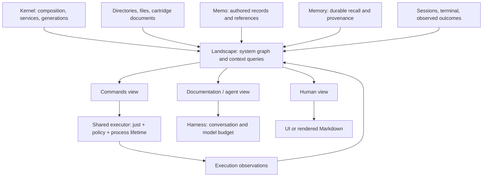

# Cartridge assessment — 2026-09-13

Working plans: [root development board](README.md), with owner-local boards and memos in all 17 cartridges. The root coordinates their work; recursive Landscape discovery across arbitrary descendants is a planned capability, not yet an established runtime guarantee.

The recommended architecture is **memo + memory + landscape**, with landscape assembling the relevant system information into context. Tools are Markdown documents containing executable `just` recipes, owned by the cartridge that implements the capability. Cartridges remain useful boundaries for state, services, process lifetime, and replacement; a tool does not need its own cartridge or repository.

This assessment covers all 17 top-level repositories. It incorporates the intended role of landscape: kernel information, directories, files, capabilities, authored records, and durable knowledge brought together for a particular query. Recommendations below are proposed changes, not descriptions of functionality already implemented.

**What independence means here**

There are three different boundaries: owning a coherent responsibility, running without other services, and building from a standalone checkout. Most cartridges have reasonable responsibility boundaries, but most Rust repositories explicitly depend on `../cartridge.ctg/workspace` and the sibling runtime. They are separately versioned components of one development checkout, not independently buildable distributions. Memory has its own workspace and standalone CLI; even its no-default-features build currently needs the sibling SDK manifest for Cargo resolution, as documented in [PORT.md](../../../../memory.ctg/PORT.md).

The shared tool wire contract also prevents full interoperability today: the suites pass, but a real MCP call to two shipped tools fails. Repository separation has not established contract compatibility.

**Assessment of each component**

Quality labels describe the implementation and evidence inspected, not production certification. Test counts are actual passing tests from this assessment, not source-code marker counts.

| Component | Independence and present responsibility | Quality and evidence | Recommendation |
| --- | --- | --- | --- |
| `memory` | Owns the durable knowledge engine, persistence, ingestion, retrieval, provenance, and CLI. No injected service dependencies. Its cartridge adapter is feature-gated. | Strong foundation. Four cartridge integration tests pass, including persistence, writer ownership, corrupted-store refusal, and replacement. The full engine suite and retrieval-quality evaluations were not run. | Keep independent. Own its memory command documents and absorb the memory-tool adapter. Keep orchestration outside the engine. |
| `memory-tool` | Depends entirely on `memory`; exposes only query/ingest through `tool.memory`. No independent state or domain. | Thin and under-tested: 131 Rust lines, zero tests. The advertised schema and execution validation differ: execution accepts `sync`, and does not itself enforce all advertised bounds. | Consolidate into `memory`. Ultimately represent these operations as memory-owned Markdown/just documents. Preserve the existing interface temporarily if consumers still need it. |
| `memo` | Owns typed Markdown, validation, revision checks, references, discovery, and observations. Core record operations have no required injected services. Landscape queries additionally require the host and discovered descriptors. | Strong foundation: 31 tests pass. Atomic writes, cancellation, corruption handling, and deterministic resolution have coverage. Retrieval is currently usage-based, not the complete proposed multi-view document interface. | Keep independent. Own document interpretation and authored-record APIs. Supply records to landscape; transfer system-wide context assembly out of memo's service implementation. |
| `landscape` | Currently a Rust library called by memo. Joins host composition, cartridge directories, Git-tracked files, tool descriptions, memos, links, and usage evidence. No standalone cartridge/process today. | Useful but incomplete for its intended role: 14 tests pass. Its graph input does not include durable memory results. It returns ranked nodes/connections and inventory, not yet the unified context requested here. | Keep its own ownership boundary and develop it into the central context service, retaining a reusable graph library. Its scope is the entire relevant system, not only memo. |
| `fs` | Six file/search tools; requires sessions to record touched files. Implements direct filesystem operations. | Good safeguards: 28 tests pass, covering freshness, guarded edits, cancellation, path/context rejection, search, and partial success. Absent from the shipped default/MCP/proxy compositions inspected. | Keep the backend. Supply owner-local command documents. Make touched-file reporting replaceable if use outside the agent is desired. Coordinate its filesystem semantics with gitfs. |
| `gitfs` | Owns Git-backed session overlays plus ship/undo/scan. Requires a Git repository. Optional model gating calls router despite no declared router dependency. | Needs integration work. Fourteen unit tests pass, but real MCP reads and scans fail because successful `content` is an object rather than the string MCP expects. Cancellation handlers acknowledge without stopping the running operation. | Keep overlay storage and shipping together because they share ownership state. Fix the contract and declare/configure optional dependencies. Do not merge direct fs writes and overlay writes until their semantics are explicit. |
| `pty` | Owns a persistent terminal, shell execution, environment discovery, and screen/output state. No injected service dependencies. | Good foundation: 23 tests pass across terminal logic and process integration. Stateful OS resource with a meaningful lifetime. Replacing UI preserves the separately owned PTY; replacing PTY itself has different consequences. | Keep independent. `shell` belongs here, with a Markdown command surface. Do not absorb PTY lifetime into UI or create another shell-tool repository. |
| `sessions` | Owns session records, canonical transcripts, buffers, and touched-file state. No injected service dependencies. | Strong persistence evidence: 20 tests pass, including write faults, revisions, corruption refusal, restart, and repair. | Keep independent. Sessions/buffers already share a sensible persistence boundary. Feed relevant session state to landscape without moving transcript ownership there. |
| `policy` | Small Lua decision service with no dependencies, used by multiple callers. Includes tool-specific defaults. | Focused, but lightly validated here: existing smoke checks cover allow/ask/deny and malformed input. No separate repository test suite. | Keep replaceable. Have the common executor consult it for document execution. Centralize interpretation so agent, proxy, and MCP do not diverge. |
| `router` | Owns provider catalogs, credentials, routing, translation, leases, listeners, and launch configuration. No required injected services. Proxy also links its protocol library. | Capable but unevenly evidenced: 14 tests pass across roughly 5,200 source/test lines. Live providers, login, and routing quality were not exercised. | Keep independent of context and tools. Export protocol helpers as a library and contribute bounded status/capability information to landscape. |
| `harness` | Requires sessions, buffers, router, and memo; optional memory/environment/terminal services come from profiles. Owns conversation projection, summaries, budgets, and context inspection. Used by agent and proxy. | Good mechanics: 36 tests pass. Real summarization fidelity was not evaluated. Context gathering currently overlaps the intended landscape responsibility. | Keep conversation projection, compaction, and model-budget adaptation here. Obtain system context from landscape rather than gathering each source independently. |
| `agent` | Orchestrates model/tool turns; requires sessions, buffers, policy, router, harness, and memo, plus selected tools. Intentionally dependent. | Good lifecycle evidence: 33 tests pass. Durable checkpoints, cancellation, approvals, and streaming have tests; live task-solving quality remains unmeasured. | Keep orchestration separate. Consume landscape queries and the common document executor. Eliminate the need to implement every new tool as a Rust `describe/call/cancel` handler. |
| `proxy` | External model-API ingress that also assembles context and runs internal tool rounds. Requires sessions, harness, router, policy, and memory. | Good local protocol tests: 14 pass, plus listener/authentication smoke. Shares the result-envelope incompatibility by inspection. Recall is assembled separately from landscape. | Keep as an optional transport. Consume the same context and execution services as agent; retain its caller-owned conversation semantics. Do not merge with router merely because both expose HTTP. |
| `mcp` | External tool transport requiring sessions and policy, dynamically discovering injected tools. Best-effort observations call memo without declaring it as required. | Seven fixture tests and initialize/list smoke pass. The real gitfs/ship invocation failure shows why listing and fake-tool tests are insufficient. | Keep one optional bridge. Expose landscape query/read and the shared executor, or derive compatibility listings from documents. No independently maintained per-tool definitions. |
| `tools` | Workspace-specific bundling and Git worktree operations. Not the generic agent tool registry, despite its name. No injected dependencies, but extensive assumptions about runtime checkout/layout. | Useful, narrow implementation: seven tests pass. Strongly coupled to runtime build/distribution layout. | Move into runtime-owned development tooling as a package/module, retaining useful commands. Publish its workflows as documents. Share Git helpers with gitfs only where behavior actually overlaps. |
| `ui` | Terminal presentation and chat backend; requires agent, sessions, buffers, router, and PTY. | Good automated foundation: 34 Bun tests pass. Module replacement and rendering behavior have tests; no interactive visual review performed here. | Keep separate from PTY and agent. Render the human view of the same documents and context the agent reads. Avoid a separate human-facing tool catalog. |
| `cartridge` | Kernel/runtime: loading, dependency composition, SDK, processes, calls, events, replacement, and host snapshots. | Fifteen reload-related tests pass, including nested replacement and rejected candidates. Full runtime suite was not run in this assessment. | Keep the infrastructure boundary. Supply kernel facts to landscape. Reuse its process/lifecycle machinery for one document execution path; domain behavior stays in owner cartridges. |

**The target context flow**

Landscape makes the information available through one query boundary and selects what is relevant to the requested context. It need not copy every database into a second store or place every source body into every prompt. Source ownership remains with the contributing cartridge. Results should retain source identifiers, revisions, relationships, and the reason they were selected.

Memory's internal knowledge graph and landscape's system graph have different jobs. Landscape should reference memory facts and provenance rather than replacing the engine's retrieval/index structures.

The three requested views are projections of the same document and identity:

| View | Proposed result |
| --- | --- |
| Commands | The selected recipe, parameters, execution location, invocation mode, and exact document revision. Reading this view does not execute it. |
| Documentation / agent | Relevant prose, usage conditions, examples, and linked context from the selected source. |
| Human | Readable Markdown with purpose, explanation, prerequisites, and outcomes, rendered for a person. |

This follows justdown's document model: frontmatter drives discovery, Markdown supplies explanation, and extracted `just` fences supply execution. Its `run`, `sidecar`, and `artifact` modes concern process/result handling; they are separate from the requested reading views. The repository presents a v0.1 specification, so adoption still requires implementing and testing the integration. See the [justdown README](https://github.com/yesitsfebreeze/justdown) and [language specification](https://github.com/yesitsfebreeze/justdown/blob/main/justdown.md).

**What is still missing**

1. **One complete landscape query path.** The kernel snapshot exists in [src/landscape.rs](../../../../cartridge.ctg/src/landscape.rs). File joins and ranking exist in [landscape](../../../../landscape.ctg/src/lib.rs). Memo currently assembles those with descriptors and record rows in [service.rs](../../../../memo.ctg/src/service.rs). Durable recall and harness/proxy context gathering still sit outside that path.
2. **One document definition for each capability.** Tool schemas/descriptions currently live in Rust, commands in `cartridge.json`, and human instructions in README/memo files. A change can require editing all three. Generate the relevant views from owner-local Markdown instead. Keep the cartridge manifest focused on loading/composition.
3. **A document reader and shared recipe executor.** Current memo resolution supports usages and revision-bound references, but does not implement justdown fence execution or its full link semantics. Its existing resolver also scores Markdown bodies, whereas justdown specifies frontmatter-only discovery. Decide this explicitly for tool documents; keep broader semantic recall available through memory.
4. **Cross-component execution contracts.** Fix existing result drift during migration. The lasting common contract belongs to the executor and transport bridges, rather than handwritten adapters for every capability. Preserve exit status, stdout/stderr, cancellation, sidecar ownership, and artifact references.
5. **Explicit partial-context reporting.** Landscape's current memo survey tolerates scan/journal failures by returning empty data. That can be useful for exploration, but a central context response should identify unavailable contributors so an empty result is not mistaken for complete knowledge.

**Concrete consolidation order**

First, absorb `memory-tool` into the memory cartridge's adapter layer and give memory its own command documents. Its engine remains a database/CLI. The local [memory instructions](../../../../memory.ctg/AGENTS.md) explicitly exclude agent orchestration, MCP hosting, and plugin runtimes; the generic document runner belongs outside memory. If `tool.memory` remains during migration, register it alongside `memory`, retain its narrow query/ingest semantics, then remove the extra profile entries, builtin link, workspace member, catalog entry, and submodule once callers have migrated. Check default and MCP discovery carefully; the current proxy profile includes memory but does not include memory-tool, so automatic tool discovery could expand its exposed surface after consolidation.

Second, establish landscape's query ownership and connect memory as a contributor. Move the existing graph assembly behind that boundary while keeping memo's record operations intact. Let harness and proxy consume it. Avoid cycles: contributors provide facts; landscape queries them; callers consume landscape's output.

Third, implement one vertical document path: a memory-owned Markdown definition is discovered through landscape, read in all three views, executed through `just`, and produces an attributed result. Test a document edit being reflected in discovery and execution, including stale revision handling. This demonstrates the intended system before migrating every capability.

Fourth, migrate memo, file operations, Git workflows, shell, and development commands to the same path. Keep the domain backends and their tests. MCP, proxy, and agent become clients of the common path. Move workspace-specific `tools` code into runtime-owned development tooling.

Keep memo and memory separate. Keep landscape independent and central. Keep PTY separate from UI. Keep router separate from proxy. Keep direct filesystem and Git-overlay behavior distinct until a deliberate storage abstraction can preserve both. Consolidate wrapper repositories and duplicate definitions before merging stateful domains.

**Verification and limits**

Completed without using live model providers or existing memory/session stores:

- Rust sibling workspace: **241 passed**, including every member's tests; memory-tool contributes zero tests.
- UI: **34 passed**.
- Memory cartridge integration: **4 passed**.
- Runtime tests filtered by `reload`: **15 passed**.
- Existing isolated smoke checks: policy decisions, proxy listener/authentication, and MCP initialize/list all passed.
- Additional real-host/MCP probe in a temporary Git repository: direct `tool.gitfs` read succeeds with object-valued `content`; MCP `gitfs/read` and `ship/scan` both return `-32603: invalid tool result envelope`. This reproduces the mismatch between [gitfs results](../gitfs.ctg/service.rs), [ship results](../gitfs.ctg/ship.rs), and [MCP validation](../mcp.ctg/service.rs). Proxy applies the same string requirement in [service.rs](../proxy.ctg/service.rs).

Commands used: `cargo test --manifest-path cartridge.ctg/workspace/Cargo.toml --workspace`, `bun run test` in ui.ctg, `just test memory --test cartridge`, `just test runtime reload`, and `just smoke`. Logs are in `/tmp/cartridge-assessment-*-tests.log` and `/tmp/cartridge-assessment-smoke.log`.

Passing suites establish useful component behavior, not complete interoperability, retrieval quality, summarization quality, or production readiness. No application code, profiles, repositories, or stores were consolidated as part of this assessment. This report is the proposed work boundary.
