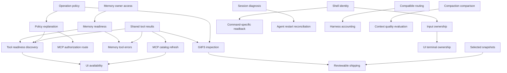

# Cartridge improvement programme

## Outcome

Turn the 2026-09-13 cartridge usefulness assessment into delivered behavior across
all 15 runnable cartridges. The scope is 45 requested improvements, three assessed
downsides per cartridge, and one shared tool-result prerequisite discovered during
planning. Each improvement has one leaf work item; each cartridge has one coordinating
parent. The runtime and landscape library participate only where those outcomes
require shared contracts, discovery or context.

The user asked for working plans. The plans are created; implementation remains open.
No usefulness score is treated as an empirical baseline or a promised result.
[[cartridge-improvement-evidence]] separates live observations, source findings,
reported tests and proposals. [[@prd/routine/plan-cartridge-work.md]] defines the reusable procedure.

## Start here

The first four work items can start independently after checking live source ownership.
They have no hard prerequisites inside this programme. Land changes to shared files
serially and revalidate against the integrated revision.

| Order | Work | Why first | Ready definition |
| --- | --- | --- | --- |
| 1 | [improve-tool-result-contract](../../prds/improve-tool-result-contract/prd.md) | Real tool calls must survive the transport boundary before richer tools are useful. | Reproduce GitFS read and ship scan through a temporary real MCP host. |
| 2 | [improve-policy-operation-rules](../../../policy/prds/improve-policy-operation-rules/prd.md) | Read-only GitFS should be usable without a blanket mutation grant. | Establish the old/new rule precedence fixture; preserve current profiles. |
| 3 | [improve-memory-owner-access](../../../memory/prds/improve-memory-owner-access/prd.md) | Recall currently fails when another process owns the configured store. | Reproduce two-client access using a disposable store and inspect the existing owner protocol. |
| 4 | [improve-gitfs-snapshot-selection](../../../gitfs/prds/improve-gitfs-snapshot-selection/prd.md) | A declared path filter should select exactly those paths. | Reproduce A/B selection in a temporary Git repo. |

Next, unlock [improve-policy-explain](../../../policy/prds/improve-policy-explain/prd.md), [improve-gitfs-readable-diff](../../../gitfs/prds/improve-gitfs-readable-diff/prd.md),
[improve-memory-readiness](../../../memory/prds/improve-memory-readiness/prd.md), [improve-memory-tool-errors](../../../memory/prds/improve-memory-tool-errors/prd.md) and
[improve-mcp-approval-route](../../../mcp/prds/improve-mcp-approval-route/prd.md) as their actual needs become satisfied.
Other prerequisite-free work includes compact memo discovery, type drilldown,
shell identity, session diagnosis, route explanation, capability routing, filesystem
search paging, compaction comparison and development-tool preflight.

## Delivery stages

Stages set priority and integration checkpoints. They are not artificial global barriers:
a ready child can be worked on before all unrelated tasks in an earlier stage finish.

| Stage | Outcomes | Exit evidence |
| --- | --- | --- |
| 0 — Reliable access | Shared results, operation policy/explanation, safe read discovery, memory owner access/readiness/errors, snapshot selection. | Real MCP reads/scan succeed, reads and writes have distinct policy outcomes, two-client memory recall works, selected snapshot touches only A. |
| 1 — Discovery and control | Bounded/fresh memo retrieval, individual types, fact drilldown, terminal identity/ownership/command waiting, session mapping/recovery, catalog refresh, constrained resources, reviewable shipping. | A cold caller finds and inspects a capability, sees its readiness, executes an authorized fixture operation and receives attributable results. |
| 2 — Context and diagnostics | Token/byte accounting, compaction comparisons, route explanations/capability/cost metadata, proxy usage/traces/recovery, interrupted-agent reconciliation. | Cross-round results remain attributable and accounting exposes unknowns; failed/restarted runs do not replay uncertain mutations. |
| 3 — Workflow and measured quality | Narrow memory correction, retention, direct/overlay attribution, guarded FS operations, worktree/bundle improvements, transcript/owner/readiness UI and quality evaluations. | All component acceptance checks pass; comparative evaluations report actual outcomes and retained limitations instead of architecture-based scores. |

## Dependency map

The leaf needs fields are the exact dependency graph. This diagram shows the main paths.



## Component plans and coverage

Each component plan maps the assessment's three improvements to its three leaf items,
and records all three downside mitigations or retained limitations.

| Cartridge | Plan | Improvement IDs |
| --- | --- | --- |
| Memo | [improve-memo-programme](../../../memo/prds/improve-memo-programme/prd.md) | [improve-memo-compact-landscape](../../../landscape/prds/improve-memo-compact-landscape/prd.md), [improve-memo-stale-evidence](../../../memo/prds/improve-memo-stale-evidence/prd.md), [improve-memo-types-drilldown](../../../memo/prds/improve-memo-types-drilldown/prd.md) |
| Memory | [improve-memory-programme](../../../memory/prds/improve-memory-programme/prd.md) | [improve-memory-owner-access](../../../memory/prds/improve-memory-owner-access/prd.md), [improve-memory-readiness](../../../memory/prds/improve-memory-readiness/prd.md), [improve-memory-provenance](../../../memory/prds/improve-memory-provenance/prd.md) |
| Memory tool adapter | [improve-memory-tool-programme](../../../memory/prds/improve-memory-tool-programme/prd.md) | [improve-memory-tool-get](../../../memory/prds/improve-memory-tool-get/prd.md), [improve-memory-tool-correct](../../../memory/prds/improve-memory-tool-correct/prd.md), [improve-memory-tool-errors](../../../memory/prds/improve-memory-tool-errors/prd.md) |
| GitFS and ship | [improve-gitfs-programme](../../../gitfs/prds/improve-gitfs-programme/prd.md) | [improve-gitfs-readable-diff](../../../gitfs/prds/improve-gitfs-readable-diff/prd.md), [improve-gitfs-snapshot-selection](../../../gitfs/prds/improve-gitfs-snapshot-selection/prd.md), [improve-gitfs-reviewable-ship](../../../gitfs/prds/improve-gitfs-reviewable-ship/prd.md) |
| PTY and shared shell | [improve-pty-programme](../../../pty/prds/improve-pty-programme/prd.md) | [improve-pty-shell-identity](../../../pty/prds/improve-pty-shell-identity/prd.md), [improve-pty-input-ownership](../../../pty/prds/improve-pty-input-ownership/prd.md), [improve-pty-command-wait](../../../pty/prds/improve-pty-command-wait/prd.md) |
| MCP bridge | [improve-mcp-programme](../../../mcp/prds/improve-mcp-programme/prd.md) | [improve-mcp-approval-route](../../../mcp/prds/improve-mcp-approval-route/prd.md), [improve-mcp-tool-readiness](../../../mcp/prds/improve-mcp-tool-readiness/prd.md), [improve-mcp-refresh-catalog](../../../mcp/prds/improve-mcp-refresh-catalog/prd.md) |
| Policy | [improve-policy-programme](../../../policy/prds/improve-policy-programme/prd.md) | [improve-policy-operation-rules](../../../policy/prds/improve-policy-operation-rules/prd.md), [improve-policy-resource-scope](../../../policy/prds/improve-policy-resource-scope/prd.md), [improve-policy-explain](../../../policy/prds/improve-policy-explain/prd.md) |
| Sessions | [improve-sessions-programme](../../../sessions/prds/improve-sessions-programme/prd.md) | [improve-sessions-client-mapping](../../../sessions/prds/improve-sessions-client-mapping/prd.md), [improve-sessions-retention](../../../sessions/prds/improve-sessions-retention/prd.md), [improve-sessions-recovery](../../../sessions/prds/improve-sessions-recovery/prd.md) |
| Harness | [improve-harness-programme](../../../harness/prds/improve-harness-programme/prd.md) | [improve-harness-token-accounting](../../../harness/prds/improve-harness-token-accounting/prd.md), [improve-harness-compaction-diff](../../../harness/prds/improve-harness-compaction-diff/prd.md), [improve-harness-quality-eval](../../../harness/prds/improve-harness-quality-eval/prd.md) |
| Router | [improve-router-programme](../../../router/prds/improve-router-programme/prd.md) | [improve-router-route-explanation](../../../router/prds/improve-router-route-explanation/prd.md), [improve-router-capability-routing](../../../router/prds/improve-router-capability-routing/prd.md), [improve-router-cost-latency](../../../router/prds/improve-router-cost-latency/prd.md) |
| Proxy | [improve-proxy-programme](../../../proxy/prds/improve-proxy-programme/prd.md) | [improve-proxy-total-usage](../../../proxy/prds/improve-proxy-total-usage/prd.md), [improve-proxy-tool-trace](../../../proxy/prds/improve-proxy-tool-trace/prd.md), [improve-proxy-continuation-recovery](../../../proxy/prds/improve-proxy-continuation-recovery/prd.md) |
| Agent loop | [improve-agent-programme](../../../agent/prds/improve-agent-programme/prd.md) | [improve-agent-task-baseline](../../../agent/prds/improve-agent-task-baseline/prd.md), [improve-agent-resume-boundaries](../../../agent/prds/improve-agent-resume-boundaries/prd.md), [improve-agent-decision-attribution](../../../agent/prds/improve-agent-decision-attribution/prd.md) |
| Filesystem tools | [improve-fs-programme](../../../fs/prds/improve-fs-programme/prd.md) | [improve-fs-change-provenance](../../../fs/prds/improve-fs-change-provenance/prd.md), [improve-fs-revision-guards](../../../fs/prds/improve-fs-revision-guards/prd.md), [improve-fs-search-pages](../../../fs/prds/improve-fs-search-pages/prd.md) |
| Workspace tools | [improve-tools-programme](../../../runtime/prds/improve-tools-programme/prd.md) | [improve-tools-preflight](../../../runtime/prds/improve-tools-preflight/prd.md), [improve-tools-worktree-resume](../../../runtime/prds/improve-tools-worktree-resume/prd.md), [improve-tools-bundle-provenance](../../../runtime/prds/improve-tools-bundle-provenance/prd.md) |
| Terminal UI | [improve-ui-programme](../../../ui/prds/improve-ui-programme/prd.md) | [improve-ui-run-history](../../../ui/prds/improve-ui-run-history/prd.md), [improve-ui-terminal-owner](../../../ui/prds/improve-ui-terminal-owner/prd.md), [improve-ui-tool-availability](../../../ui/prds/improve-ui-tool-availability/prd.md) |

## Shared footprints and coordination

- Policy, MCP, proxy and the shared tool-result work meet at dispatch/result validation.
  Settle the result envelope and policy evaluation contracts before landing adapters.
  Coordinate with [rpc-contracts-run-across-rust-lua-and-bun](../../prds/rpc-contracts-run-across-rust-lua-and-bun/prd.md); do not claim its work.
- Memory engine and adapter leaves meet at src/cartridge.rs and lifecycle errors.
  Preserve the one-writer contract. Follow memory.ctg/AGENTS.md in isolated worktrees.
- Sessions main.rs is shared by correlation, retention, recovery and filesystem evidence.
  Reconcile with [the-board-is-channels-of-lines](../../../sessions/prds/the-board-is-channels-of-lines/prd.md) before changing persistence shape.
- PTY input changes overlap [pty-encodes-input](../../prds/pty-encodes-input/prd.md). UI changes overlap
  [the-sidebar-slides-over-the-shell](../../prds/the-sidebar-slides-over-the-shell/prd.md) and [the-terminal-is-drawn-from-pty](../../prds/the-terminal-is-drawn-from-pty/prd.md).
  Preserve the foreground terminal and their existing owners.
- Memo and landscape changes must preserve the existing resolver and ranking work:
  [a-search-ranks-current-guidance-over-delivered-history](../../../landscape/prds/a-search-ranks-current-guidance-over-delivered-history/prd.md) and
  [one-search-covers-the-record-and-memory](../../../landscape/prds/one-search-covers-the-record-and-memory/prd.md). Do not create another ranking engine.
- Harness evaluation extends [rolling-context-retains-decision-evidence](../../prds/rolling-context-retains-decision-evidence/prd.md) and
  coordinates with [long-horizon-recall-benchmark](../../prds/long-horizon-recall-benchmark/prd.md). Agent attribution does not
  reimplement [agents-query-the-tool-graph](../../prds/agents-query-the-tool-graph/prd.md).
- The assessment file also proposes document execution, a central landscape query
  boundary and repository consolidation. Keep those as separately scoped architecture
  work; these improvements must neither require nor silently enact those migrations.

## Check

Before implementation, record the current result for each scenario against a fixed
fixture, source revision and profile. The following are completion targets, not claims
about today's implementation.

- [ ] Every subwork parent and [improve-tool-result-contract](../../prds/improve-tool-result-contract/prd.md) is done, with all
      leaf checks and prerequisites satisfied and Result evidence recorded.
- [ ] A real MCP client lists and reads a temporary GitFS overlay, scans a harmless
      fixture, queries/gets a seeded memory fact, and reads the shared PTY state.
      These five scenarios succeed under their documented least necessary grants.
- [ ] Denied mutation, stale revision, competing store owner, interrupted operation,
      stale catalog and changed source fixtures produce explicit attributable outcomes;
      no failure is disguised as an empty successful result.
- [ ] All 45 requested improvements have their leaf evidence and all 45 downside
      entries have mitigation evidence or an explicit retained limitation.
- [ ] Default memo landscape output satisfies its proposed 16 KiB fixture target;
      retrieval fixtures report hit ranking and why matches were selected. Metadata
      does not imply verification or instruction authority.
- [ ] Quality reports separate deterministic fixture checks from opt-in model runs,
      record revisions/configurations, and count invented permission/completion as
      failures. Compare actual task completion, constraint adherence, tokens, tool
      calls and latency; do not turn subjective usefulness ratings into measurements.
- [ ] Relevant integrated module gates and real-boundary smoke tests pass on the same
      integrated revisions. Full required memory checks pass before its changes land.
- [ ] Profiles, command declarations, owner-local docs and recovery instructions match
      delivered behavior; no default tool exposure expands as an incidental side effect.

Final integrated acceptance gates (run after the scenario fixtures above are implemented):

```sh
just smoke
just check
just test
just links
```

## Verification strategy

All listed source paths in leaf items are starting points verified during planning.
A planned new fixture must be wired into the existing command shown by its leaf.
Gate commands run from `/Users/feb/dev/cartridge`; the forwarded Justfile chooses
the correct repository. Use isolated temporary profiles, repositories, remotes and
stores. Ordinary gates use fixture providers, not paid inference or private data.

At Stage 0 and after affected transport changes, use `just smoke` plus the real
tool-call scenarios added to that entry point. At each component landing, run its
scoped tests/checks. At the final integrated revision run the project's required
`just check`, `just test` and `just links`; a prior result can be reused only
when the relevant source and configuration have not changed.

Tests are future implementation obligations. This planning task verifies documents,
links, paths and dependency structure; it does not claim product behavior passed.

## Execution and completion rules

- Read current records and claim an executable leaf before implementation. New plans
  are open with no owner; no existing active claim has been reassigned.
- A size S is a local change, M a bounded cross-file contract, L a probe followed by
  smaller slices if needed. These are scope estimates, not fabricated calendar dates.
- First establish current behavior; if it already meets the outcome, record evidence
  and avoid duplicating it. Technical defaults in Approach are recommendations to
  verify, not attributed user decisions.
- Stop at a failing acceptance boundary and record the cause. Preserve store locks,
  user work and live permissions. Reconcile ambiguous external effects explicitly.
- Commit implementation inside affected submodules before updating parent pointers
  when landing is requested. A plan, commit or passing unrelated test is not done.
- If scope changes, update leaf Outcome, Check, needs and coverage together using
  revision-checked memo writes. Parents roll up completed children; they are never
  scheduled as duplicate implementation.

## Planning validation

[[cartridge-plan-validation]] records coverage, source-path checks and dependency validation.
The planning deliverable is complete; the implementation status above remains open.
