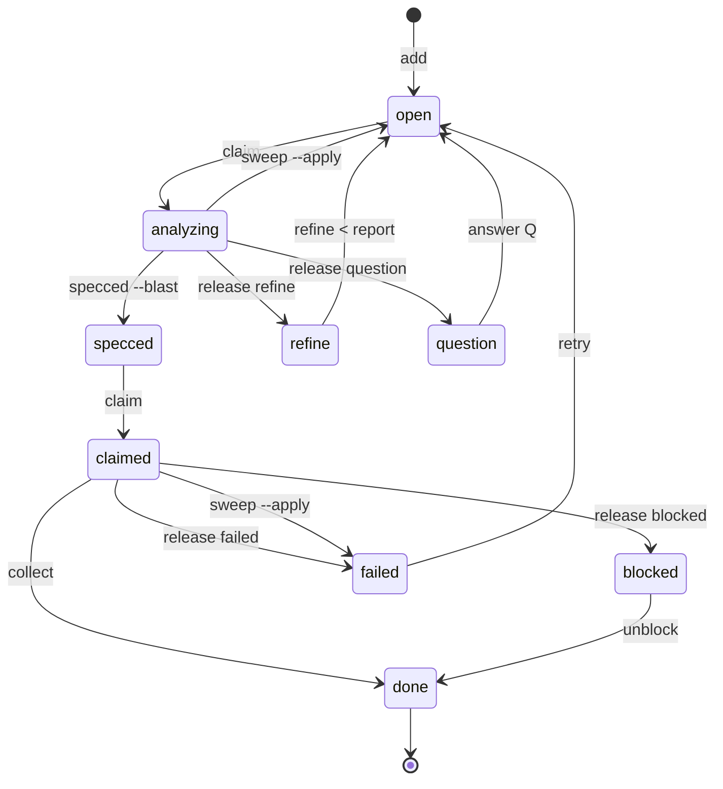

# pearde — the PRD board

A board of PRDs — product requirement definitions — as files under
`.pearde/prds/`, one session that moves them through nine states with one command each, and a
live page that draws the board. Nothing leaves the machine: Python 3, no
dependency, no build step.

## In sixty seconds

```sh
python3 <repo>/resources/pearde.py install --apply <skills-dir>
pearde init --example
pearde add "Ship the quickstart"
pearde
pearde view
```

| line | prints |
|---|---|
| `install --apply` | `✓ built <skills-dir>/<name>` for the twelve skills, then the two lines the next four need: `alias pearde='python3 <repo>/resources/pearde.py'` and `export PEARDE_AS=engineer` — add both to your shell |
| `init --example` | `board example · language English — pearde settings language=<l> changes it`, what it wrote (`settings.md`, `vision.md`, four `.gitignore` names), `serve: started on http://127.0.0.1:8443`, one `doctor` report, then three lines: the page's URL, `pearde add`, `pearde` |
| `add` | the progress line: `▸ ship-the-quickstart: — → open · done 2/9 · 14% · … · as engineer` — every state change prints one |
| `pearde` | the board on one page — `board`, `vision`, `counts`, `progress`, then the five bands in dispatch order: `collect`, `waiting on you`, `in flight`, `ready`, `gated` |
| `view` | `serve: watching example · <path> · live view http://127.0.0.1:8443/board/example`, and the browser opens on it |

The example board is one PRD in every band, so the page and the scan show
every shape at once. `pearde init` with no flag writes an empty board.

## What is on disk

| path | is | written by |
|---|---|---|
| `.pearde/prds/<name>/prd.md` | one PRD: frontmatter carries `state:`, `priority:`, `needs:`, `footprint:`; the body is the request as a contract | `add` writes it, the commands move `state:`, an analyst adds `## Questions` |
| `.pearde/prds/<name>/specs/` | one implementable unit per file, with `- [ ]` boxes an implementer ticks as it works | the analyst; `specced` reads and refuses |
| `.pearde/memos/` | decisions the code will not explain — what was chosen, what it beat, why | `pearde memo add <subject>` |
| `.pearde/workflows/` | how a kind of job is done, as steps a worker follows and improves on every run | seeded with the board; a worker's edits, pasted at collect |
| `.pearde/settings.md` | the board's knobs: `language`, `workers`, `pipeline`, `weight-default`, `gantt-day`, and the optional ones | `init`, then `pearde settings <key>=<value>` |
| `.pearde/vision.md` | the destination in one sentence, and `terminals:` — the PRDs whose completion is it — which orders the queue | `init` writes the template; you write the sentence |

A directory holding `prd.md` is a PRD, and a child directory holding its own
is a child PRD. `specs/`, `memos/` and `workflows/` hold none, so the scan
walks past them.

## The nine states



## The round

| step | command | the orchestrator decides |
|---|---|---|
| 1 scan | `pearde scan` · `pearde sweep` once per session · read `.pearde/.state/round.md` · `pearde init` when there is no board | nothing — read |
| 2 answer | `pearde answer <prd> Q<n> "<text>"` per answer | what to put to the user, per @references/drill.md, and what they said |
| 3 refine | `pearde refine <prd> < report` | whether the analyst's `## Split` table is usable; a drill when it is not |
| 4 spec ahead | `pearde claim <prd> <worker>` · `pearde brief <prd> --worker <worker>` → dispatch as `pearde-analyst` | which persona the job wears |
| 5 implement | the same two commands, dispatched as `pearde-implementer` | which persona the job wears |
| 6 collect | read the returned line · apply or refuse `## Workflow` edits · `pearde collect <prd>` | whether to believe the report; whether an edit was the atomic's |
| 7 knowledge | `python3 resources/knowledge.py query "<the frontier's open question>"` per PRD about to be drilled | whether the record already answers it — cite the note under `## Answers` and skip the question, or let the drill stand |
| 8 drill, then hand back | one drill round over the frontier, written to `.pearde/.state/ask.md` · rewrite `.pearde/report.md` and `.pearde/.state/round.md` · return `ASK` / `DRAINED` / `BLOCKED` | the forks and their three answers |

The round runs in a `pearde-round` worker, never in the session the user
asked: that session dispatches, carries answers back, and holds one line per
round — @references/parts/dispatch.md. A window is billed on every turn it
survives, so the one that fills is the one that ends.

The tool moves, the orchestrator chooses: every command checks its own gate
and refuses what @references/parts/states.md forbids, and the right-hand
column is the only thing a round thinks about.

## Three rings

Everything below is one of three rings, and a newcomer meets them in order.
Stop at the ring you need.

**Core** is the board, the nine states, the round and the page — the five
lines above, and what they touched. One session works it, and it is the
orchestrator: it moves the states, and workers do the work — `@@workers` is
the split and the brief each one is handed. The session works as a persona,
`engineer` until switched. **One question, one file.** A scope is what a
feature is made of, not a reading list — open the file that answers what is
in front of you, and let it send you on. These are the mid-round lookups,
and each is one file:

| the question in front of you | the one file |
|---|---|
| what the session that was asked does | @references/parts/dispatch.md |
| what the round does next | @references/parts/loop.md |
| what a compaction lost | `.pearde/.state/round.md`, then `scan`. @references/parts/round.md |
| what to hand a worker, and who it works as | @references/parts/workers.md |
| what a state means, and what moves it | @references/parts/states.md |
| what the progress line prints | @references/parts/progress.md |
| what goes in the commit | @references/parts/commits.md |
| which frontmatter key, and its default | @references/parts/contract.md |
| what a worker's out-of-scope finding becomes | @references/parts/derived.md |
| who works the session | @references/parts/personas.md |
| putting one problem to a colleague | @references/parts/consult.md |
| what a worker follows, and how a run improves it | @references/parts/workflows.md |

Everything else is a scope, read when its handle fires and not before — the
whole of this table is a book, and a round that opens it reads it again after
every compaction:

| stage | scopes |
|---|---|
| reading the board | `@@board` · `@@states` · `@@order` · `@@derived` · `@@master` · `@@settings` |
| doing the work | `@@workers` · `@@specs` · `@@workflows` · `@@personas` · `@@consult` · `@@drill` · `@@language` |
| leaving a record | `@@commits` · `@@memos` · `@@progress` · `@@report` |
| working it by hand | `@@handles` · `@@view` · `@@statusline` · `@@install` · `@@doctor` · `@@guard` |

The core ring, whole, is `@@loop`.

**Advisors** are what a PRD reaches for when it needs one, and none of them
moves a state. A one-line title is too thin to build, so `drill` interviews
you until it is a contract, one round of questions at a time, each with three
prepared answers. A choice the code will not explain becomes a `memo`, written
when the call is made. A job that recurs becomes a `workflow` of atomics that
gets better on every run. A persona is who is working — `engineer`, `designer`,
`skeptic` and the rest — switchable for a session, and `ask <id>` puts one
problem to one of them without switching. `report` writes the board for a
person, in plain words, rewritten whole. Open `@@drill`, `@@memos`,
`@@workflows`, `@@personas`, `@@consult` or `@@report` when the PRD in front
of you needs that one.

**Tools** are what you meet when something is wired or broken. `master` names
other boards as members and plans across them; `doctor` says of every part
whether it is `ok`, `off` or `broken`, with the command that fixes it; the
`guard` is a hook that refuses a hand-written `state:` and a board walked by
hand; the status line puts the progress terms in your terminal; `scout` finds
what is worth studying; `graph` maps a folder into a queryable knowledge graph
with an Obsidian vault out; `knowledge` keeps what was learned from outside —
sources and conclusions with provenance, queried before anything new is
researched; `install` is the first line above, explained. Open `@@master`,
`@@doctor`, `@@guard`, `@@statusline`, `@@scout`, `@@graph`, `@@knowledge` or
`@@install` when one of them is in your way.

## Glossary

| word | is |
|---|---|
| PRD | one request as a contract, `.pearde/prds/<name>/prd.md`, in one of the nine states |
| spec | one implementable unit of a PRD, `specs/specNN.md`, done in one sitting |
| box | `- [ ]` under `## Acceptance` — a check that can fail, ticked when it ran |
| footprint | the paths a PRD or spec touches; two claimed PRDs never share one |
| needs | the PRDs that are `done` before this one is claimable |
| weight | `complexity:`, 1-100 — the size of the work, never a duration |
| axis | the chain from a PRD to a terminal in `vision.md`; on-axis work dispatches first |
| band | one section of the scan, in dispatch order: collect, waiting on you, in flight, ready, gated |
| collect | the transition that verifies, commits the footprint and writes `done` |
| claim | a worker holding a PRD, with a name and a time on the line |
| memo | a decision record under `.pearde/memos/`, with what it beat and why |
| workflow | an ordered route of atomics a worker follows, `.pearde/workflows/` |
| atomic | one step of a workflow: what to do, when it is done, how it fails |
| persona | who is working — a field, a bias and a way of reading |
| consult | one problem put to one persona, mid-round, without switching |
| drill | the interview that turns a title into a contract and a tree |
| master | a board whose `members:` are other boards, planned as one |
| member | a board a master merges, unchanged where it is |
| guard | the hook that refuses what the loop forbids, wired per `@@guard` |
| doctor | the check that tells a broken install from an absent one |

## Addressing

`@<path>` is one file. `@@<keyword>` is one scope. @index.md defines both
syntaxes and names the files behind every keyword. @references/files.md is the
manifest — every tracked file, one row — read when a file is added, never to
work the board.
